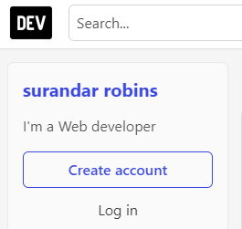
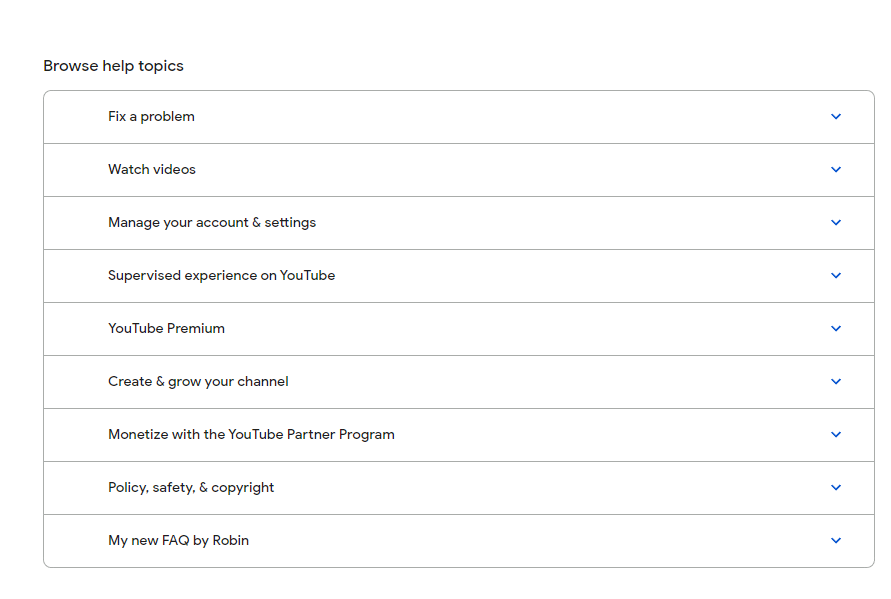
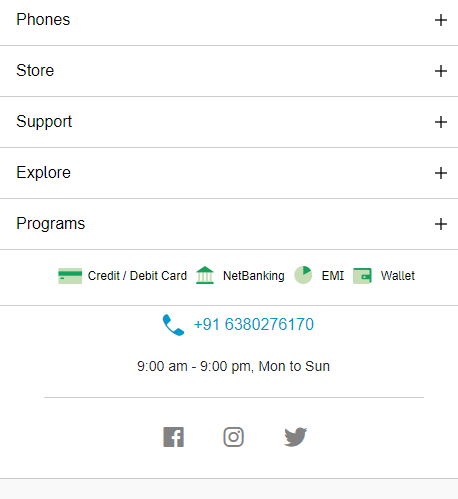
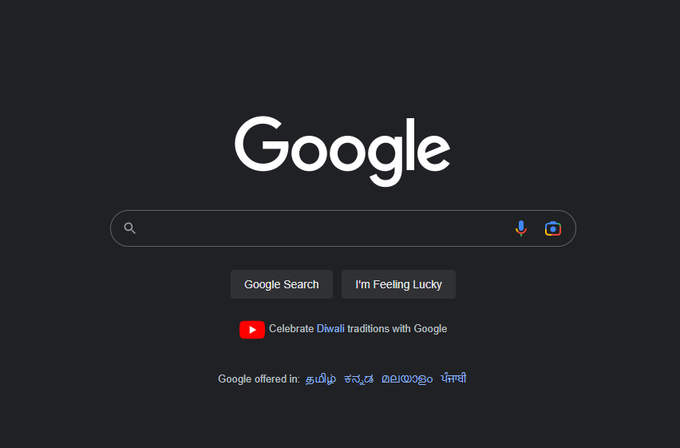
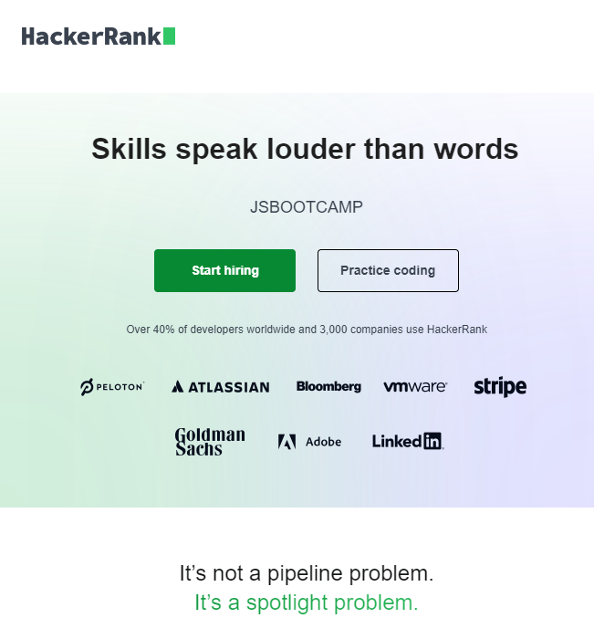

# Dom Manipulation Assignment

1. Webiste Name: [Dev To](https://dev.to/)

### Topics

    - Query Selctory, Inner HTML

### Tasks

        Target the Top description div and change the DEV Community to <Your_Name> and description to your passion

### Output

3. Webiste Name: [Youtube Support](https://support.google.com/youtube/)

### Topics

    - Get Element By Id, Create Element, Create Text Node, Append Child

### Tasks

     Add another FAQ 'My New FAQ' to the list

### Output

4. Webiste Name: [OnePlus](https://www.oneplus.in/support)

### Topics

     Query Selector, InnerText

### Tasks

      Change the contact number

### Output

5. Webiste Name: [Samsung](https://www.samsung.com/in/offer/online/samsung-fest/)

### Topics

       getElementById, createElement, InnerText, append, setAttribute

### Tasks

     Target the main div of card and change the Button text to Check out

### Output

8. Webiste Name: [Google](https://www.google.com/)

### Topics

       Remove Elements

### Tasks

     Remove alternate languages from the home page languages listed

### Output

13. Webiste Name: [Hackerrank](https://www.hackerrank.com/)

### Topics

       querySelector,innerHtml

### Tasks

Target the top description and change “Matching developers with great companies” to ‘JSBOOTCAMP“.

### Output

14. Webiste Name: [Asus](https://www.asus.com/in/)

### Topics

      querySelector,style,font-size

### Tasks

       change the fontsize of “Hot Deals” to 80px

### Output

